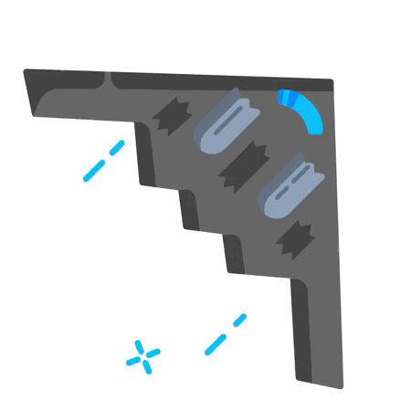

<h1 align="center">Hi 👋, I'm Ferman Khankishiyev</h1>
<h3 align="center">Full Stack Developer and Private Machine Coder</h3>

  

- 🔭 I’m currently working on **Drone air defense system**
- 🌱 I’m currently learning **Air defense systems and energetics**
- 👯 I’m looking to collaborate on **Nothing for now**

---

<h3 align="left">Languages and Tools:</h3>

---

## 📊 GitHub Stats

